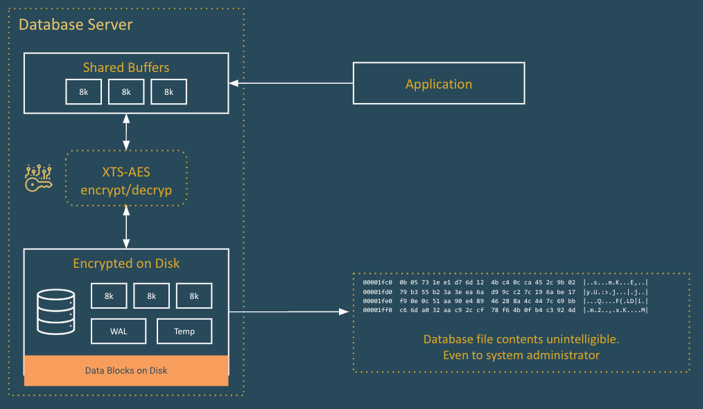

# TDEdemo
Quick demo to show TDE capabilities in EPAS. 
What is TDE?

### Pre-requisites
To deploy this demo the following needs to be installed in the PC from which you are going to deploy the demo:

- VirtualBox (https://www.virtualbox.org/)
- Vagrant (https://www.vagrantup.com/)
- Vagrant Hosts plug-in (`vagrant plugin install vagrant-hosts`)
- Vagrant Reload plug-in (`vagrant plugin install vagrant-reload`)
- A file called `.edbtoken` with your EDB repository 2.0 token. This token can be found in your EDB account profile here: https://www.enterprisedb.com/accounts/profile

### Provisioning VM's
Provision the host using `vagrant up`. This will create the bare virtual machine and will take appx. 5 minutes to complete. 

After provisioning, the hosts will have the current directory mounted in their filesystem under `/vagrant`

### Userid and Passwords
- enterprisedb / enterprisedb (Owner of the instance)

## What the scripts do
- `provision.sh` provisions the EPAS server and install ESPA 17.
- `create_cluster_no_tde.sh` creates a standard EPAS cluster on port 5444 and $PGDATA on `/var/lib/edb/as17/datanotde`
- `create_cluster_with_tde.sh` creates a TDE-enabled EPAS cluster on port 5445 and $PGDATA on `/var/lib/edb/as17/datawithtde`
- `create_users_table` creates a table called `users` with one entry.
- `deprovision.sh` tears down the EPAS server.

All scripts are in the /vagrant directory on the server.

## Demo flow
- Open two panes in your terminal, SSH both into the EPAS server using `vagrant ssh` and become the enterprisedb user using: `sudo su - enterprisedb` and move to the `/vagrant` directory.

| Left pane | Right pane |
| --- | --- |
| Show the `create_cluster_no_tde.sh` script. | Show the `create_cluster_with_tde.sh` script. |
| Create a normal database using `. ./create_cluster_no_tde.sh` | Create a normal database using `. ./create_cluster_with_tde.sh` |
| Connect to the database using `psql -p 5444 edb` | Connect to the database using `psql -p 5445 edb` |
|Show `postgresql.conf` using `\! less $PGDATA/../datanotde/postgresql.conf` | `\! less $PGDATA/../datawithtde/postgresql.conf` and search for `Data\ Encryp` |
| On both panes, run `select data_encryption_version from pg_control_init();` | |
| | Show the encryption key using `\! cat $PGDATA/../datawithtde/pg_encryption/key.bin` |
| On both panes, run `\i /vagrant/create_table_users.sql` | |
- In both panes, run `select pg_relation_filepath('users');` - Copy the result on the clipboard - |
| In both panes, drop down to the shell using `ctrl-d` | |
| Run `cd && cd as17/datanotde && ls` |  Run `cd && cd as17/datanotde && ls` |
| In both panes, run `hexdump -C <paste the result>` | |

## End of the demo
Depovision the server using `deprovision.sh`.